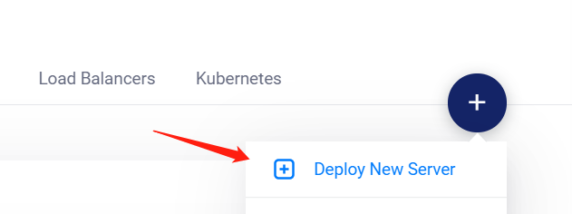
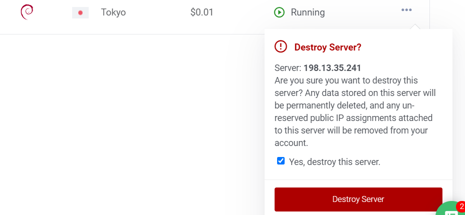
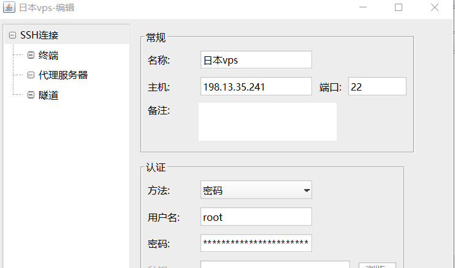
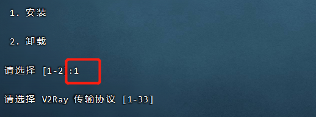
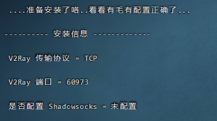
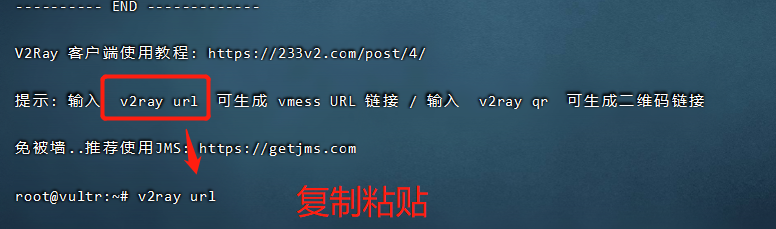
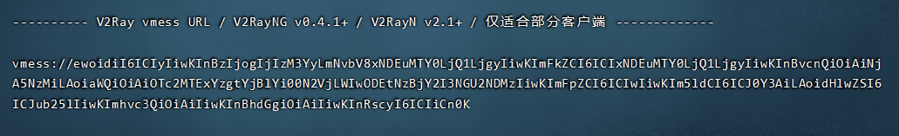
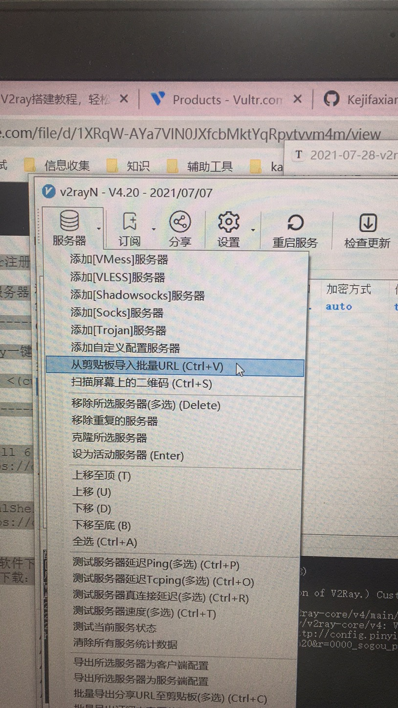
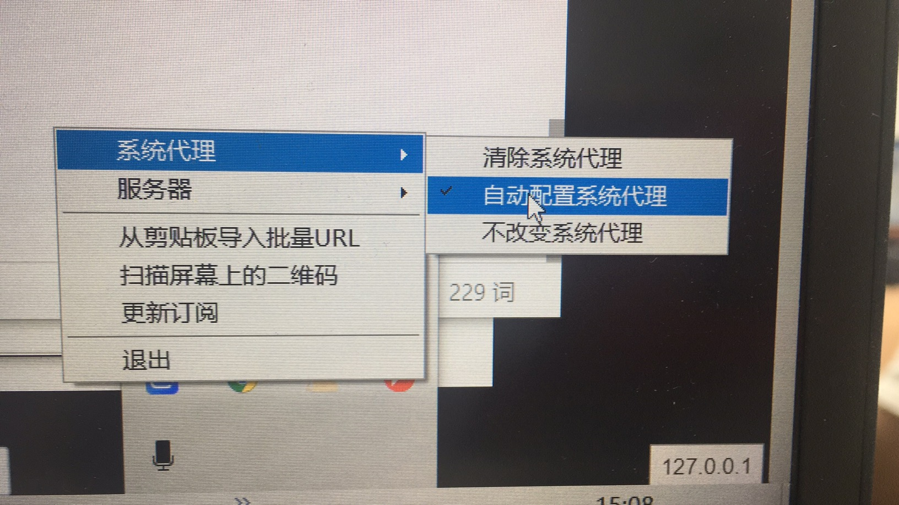

# v2ray搭建vps

```
Vultr注册链接：https://www.vultr.com/?ref=8753714

VPS服务器系统选择 Debian9或以上

---------------------------------------------------------

V2Ray一键安装代码：

bash <(curl -s -L https://git.io/v2ray.sh)

---------------------------------------------------------


Xshell 6 下载（解压密码：kjfx）：
https://drive.google.com/file/d/1IOwXCGq9COquigbUKk5QkKpyw8-9BVd_/view?usp=sharing


FinalShell下载（解压密码：kjfx）：
https://drive.google.com/file/d/1Zy7QWLQojkFbp84HVcIpx2akQ6xAfnxx/view?usp=sharing


科学软件下载：https://github.com/Kejifaxian/welcome/
备用下载：https://bit.ly/38kRjHS
```

vultr.com网站注册账号 ，买个vps服务器



买了之后ping 一下ip能否ping通，不通的说明被墙了，删了再买一个

删除后就不收费 了



使用finalshell链接



链接成功后，输入一键安装代码

`bash <(curl -s -L https://git.io/v2ray.sh)`



其他都默认按回车就行





下载v2ray

`https://github.com/Kejifaxian/welcome/`



复制生成的代码





目前看网速挺慢 可能跟选择的服务器位置有关