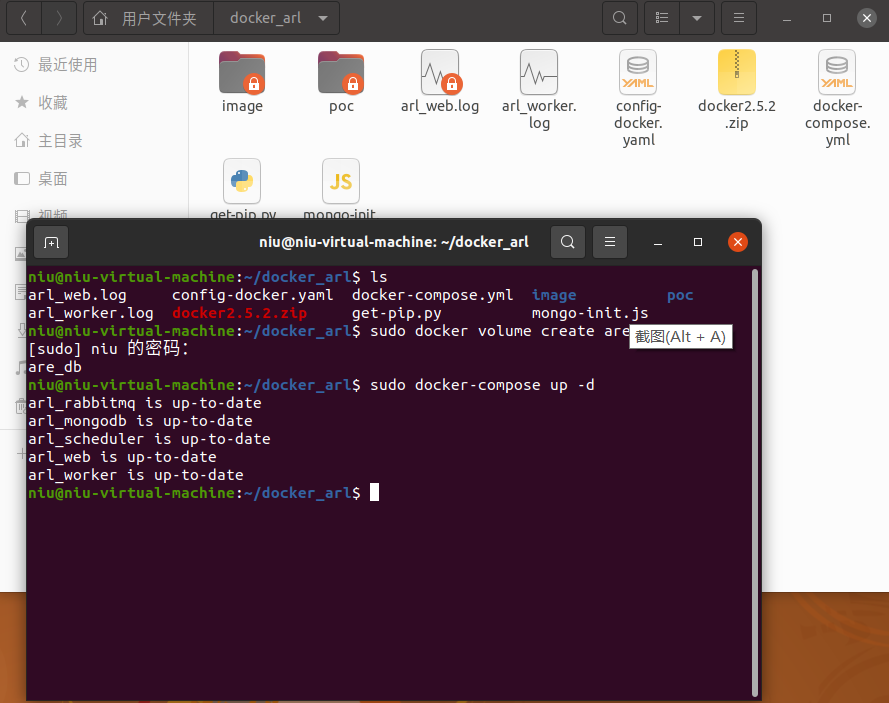
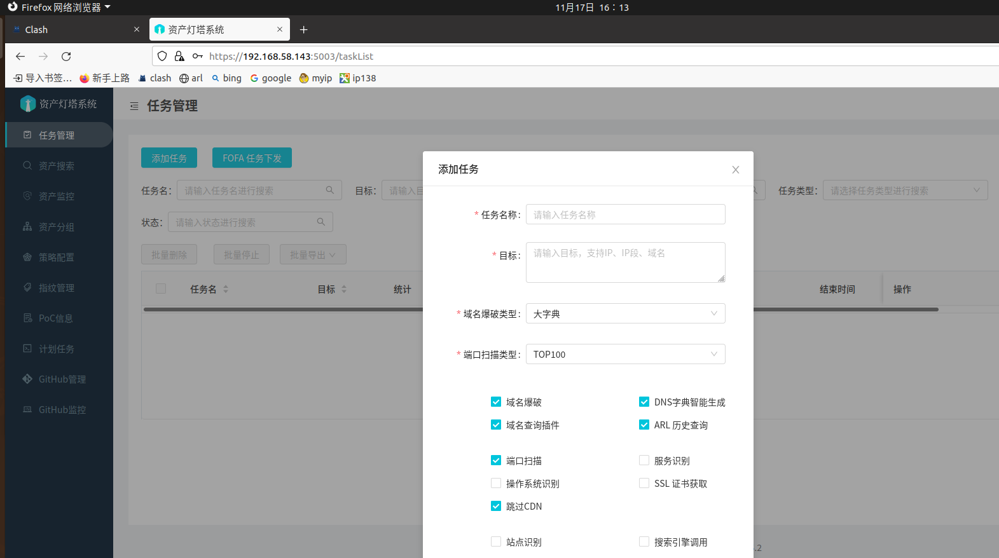
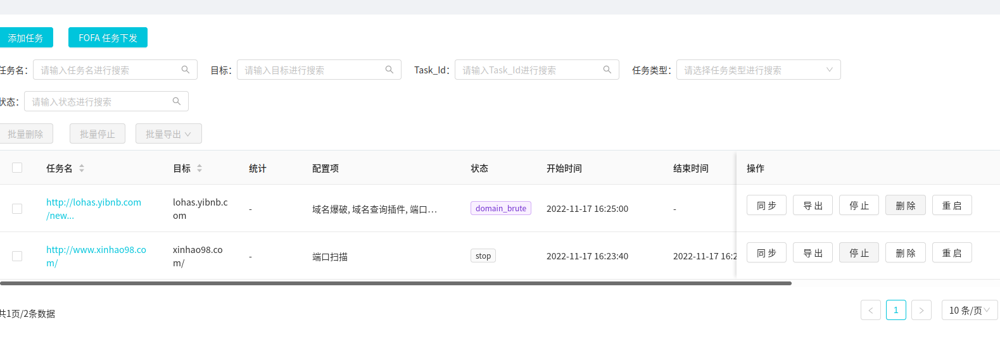

# ARL安装使用方法

- 目标机：Ubuntu 20.04，已安装docker。已安装python3.82
- 使用finalshell工具ssh连接：root权限用户（当前为虚拟机）

### 1.安装步骤

------

资产灯塔，不仅仅是域名收集

### 简介

旨在快速侦察与目标关联的互联网资产，构建基础资产信息库。 协助甲方安全团队或者渗透测试人员有效侦察和检索资产，发现存在的薄弱点和攻击面。

在开始使用之前，请务必阅读并同意[免责声明](https://github.com/TophantTechnology/ARL/blob/master/Disclaimer.md)中的条款，否则请勿下载安装使用本系统。

### 特性

1. 域名资产发现和整理
2. IP/IP 段资产整理
3. 端口扫描和服务识别
4. WEB 站点指纹识别
5. 资产分组管理和搜索
6. 任务策略配置
7. 计划任务和周期任务
8. Github 关键字监控
9. 域名/IP 资产监控
10. 站点变化监控
11. 文件泄漏等风险检测
12. nuclei PoC 调用

### 系统要求

目前暂不支持Windows。Linux和MAC建议采用Docker运行，系统配置最低2核4G。
由于自动资产发现过程中会有大量的的发包，建议采用云服务器可以带来更好的体验。

### Docker 启动

```
git clone https://github.com/TophantTechnology/ARL
cd ARL/docker/
docker volume create arl_db
docker-compose pull
docker-compose up -d 
```

或者直接下载`docker-compose`配置文件启动

```
mkdir docker_arl
wget -O docker_arl/docker.zip https://github.com/TophantTechnology/ARL/releases/download/v2.5.2/docker.zip
cd docker_arl
unzip -o docker.zip
docker-compose pull
docker volume create arl_db
docker-compose up -d
```

Ubuntu 下可以直接执行 `apt-get install docker.io docker-compose -y` 安装相关依赖

详细说明可以参考: [Docker 环境安装 ARL](https://github.com/TophantTechnology/ARL/wiki/Docker-环境安装-ARL)


## 2.使用方法

arl用法

cd ~ 进入

cd docker_arl/

sudo docker volume create arl_db

sudo docker-compose up -d

https://192.168.58.143:5003

登录名 admin  密码 arlpass





