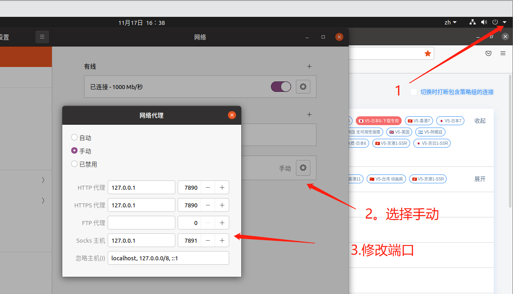

# ikuuu在Linux系统安装使用方法

- 目标机：Ubuntu 20.04，已安装docker。已安装python3.82
- 使用finalshell工具ssh连接：root权限用户（当前为虚拟机）

### 1.安装步骤

------

下载地址https://ikuuu.co/user/tutorial?os=linux&client=clash

- 1.

  执行 `cd && mkdir clash` 在用户目录下创建 clash 文件夹。

  下载适合的 Clash 二进制文件并解压重命名为 `clash

- ------

  2.

  在终端 `cd` 到 Clash 二进制文件所在的目录，执行 `wget -O config.yaml "https://api.ndsxfkjfvhzdsfio.quest/link/HyacBJLlW9Df8Hlp?clash=3"` 下载 Clash 配置文件

  wget -O config.yaml "https://api.ndsxfkjfvhzdsfio.quest/link/HyacBJLlW9Df8Hlp?clash=3"

- 3.

  执行 `./clash -d .` 即可启动 Clash，同时启动 HTTP 代理和 Socks5 代理。

  如提示权限不足，请执行 `chmod +x clash`

  

- ------

  4.

  访问 [Clash Dashboard ](https://clash.razord.top/)可以进行切换节点、测延迟等操作。

  Host: `127.0.0.1`，端口: `9090`

  

  

  点右侧测速 ，查看速度较快节点

  

  选择速度较快节点连接

  
  5.

  以 Ubuntu 19.04 为例，打开系统设置，选择网络，点击网络代理右边的 ⚙ 按钮，选择手动，填写 HTTP 和 HTTPS 代理为 `127.0.0.1:7890`，填写 Socks 主机为 `127.0.0.1:7891`，即可启用系统代理。

查询ip

## 2.使用方法简述

在clash文件夹下，
右键运行终端，
输入 ./clash -d .

浏览器打开clash的节点列表，找到网速好的节点，

右上角点设置，手动代理，设置http和https为127.0.0.1 7890 端口，socks5 7891端口 

浏览器查询ip更改成功即可

（控制台不要关，实时查看可知是否启用了代理的流量）