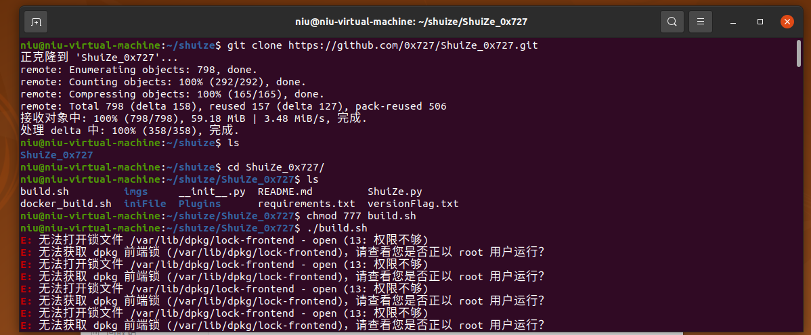
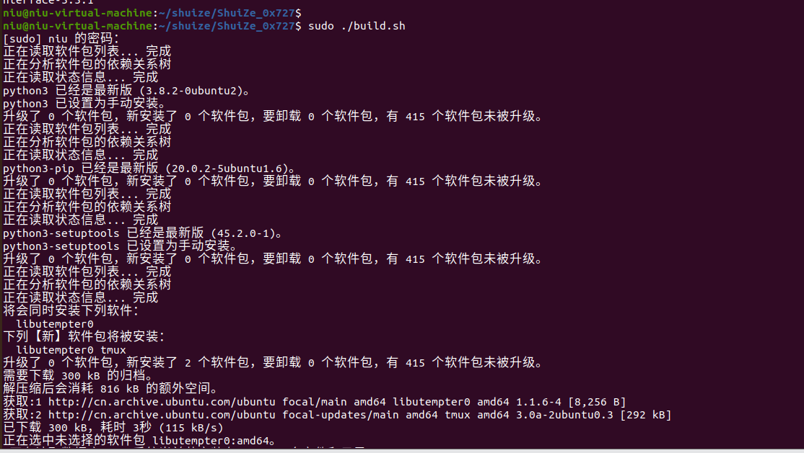
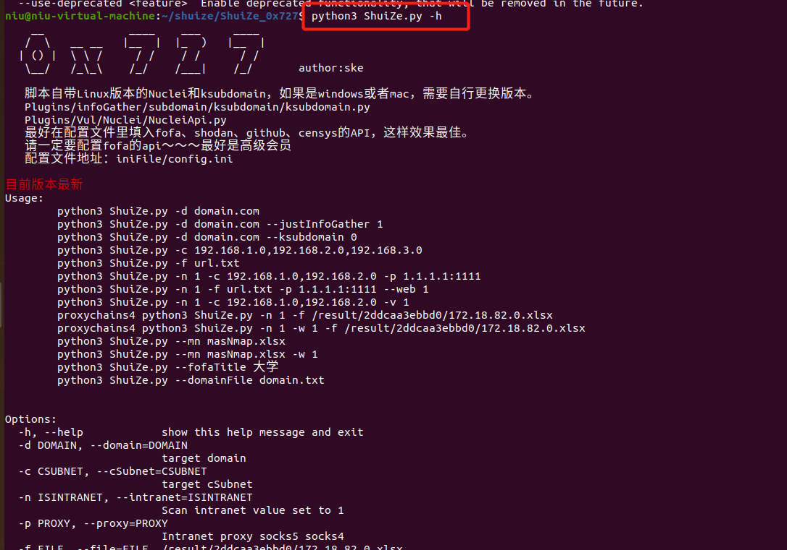
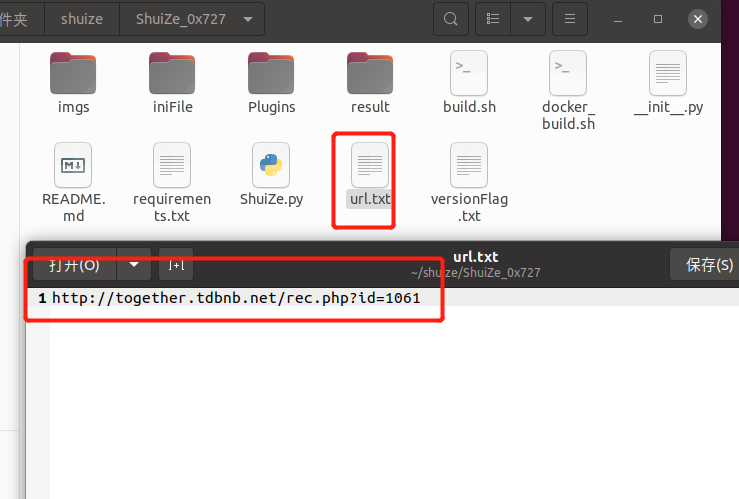
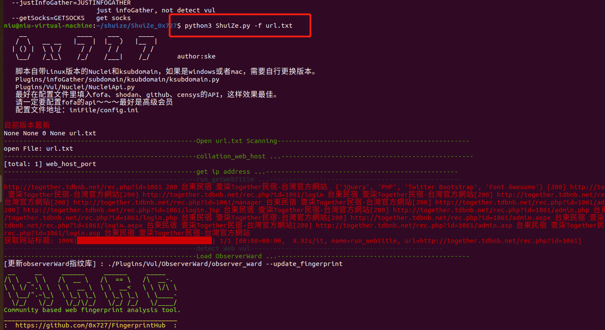
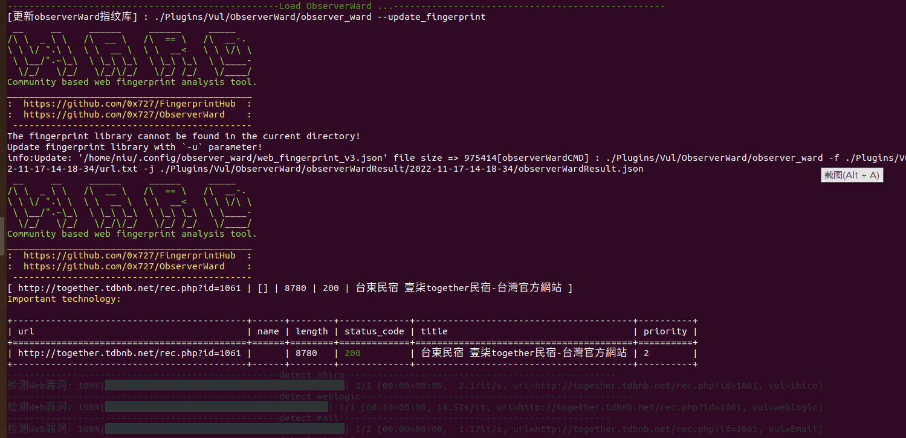
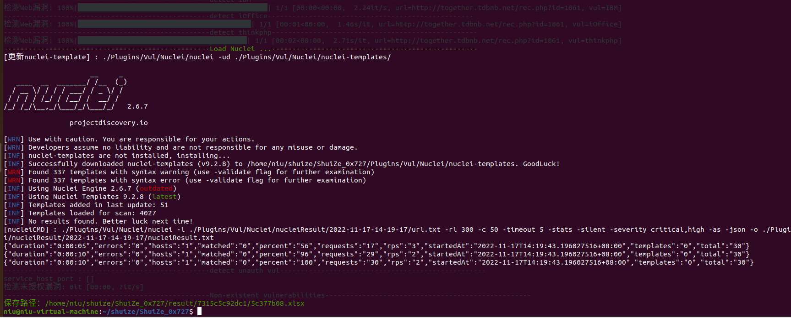
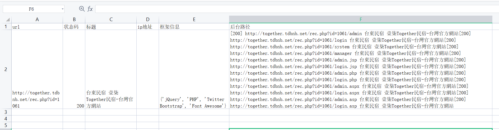

# shuize安装使用方法

- 目标机：Ubuntu 20.04，已安装docker。已安装python3.82
- 使用finalshell工具ssh连接：root权限用户（当前为虚拟机）

### 1.安装步骤

------

git clone https://github.com/0x727/ShuiZe_0x727.git

进入文件夹

给安装文件添加执行权限 chmod 777 build.sh

./ build.sh 发现权限不够，root执行

sudo ./build.sh

python3 ShuiZe.py -h

## 2.使用方法

查看帮助 python3 ShuiZe.py -h
__             ____    ___     ____
   /  \   __ __   |__  |  |_  )   |__  | 
  | () |  \ \ /     / /    / /      / /  
   \__/   /_\_\    /_/    /___|    /_/       author:ske

   脚本自带Linux版本的Nuclei和ksubdomain，如果是windows或者mac，需要自行更换版本。
   Plugins/infoGather/subdomain/ksubdomain/ksubdomain.py
   Plugins/Vul/Nuclei/NucleiApi.py
   最好在配置文件里填入fofa、shodan、github、censys的API，这样效果最佳。
   请一定要配置fofa的api～～～最好是高级会员
   配置文件地址：iniFile/config.ini

目前版本最新
Usage: 
	python3 ShuiZe.py -d domain.com
	python3 ShuiZe.py -d domain.com --justInfoGather 1
	python3 ShuiZe.py -d domain.com --ksubdomain 0
	python3 ShuiZe.py -c 192.168.1.0,192.168.2.0,192.168.3.0
	python3 ShuiZe.py -f url.txt
	python3 ShuiZe.py -n 1 -c 192.168.1.0,192.168.2.0 -p 1.1.1.1:1111
	python3 ShuiZe.py -n 1 -f url.txt -p 1.1.1.1:1111 --web 1
	python3 ShuiZe.py -n 1 -c 192.168.1.0,192.168.2.0 -v 1
	proxychains4 python3 ShuiZe.py -n 1 -f /result/2ddcaa3ebbd0/172.18.82.0.xlsx
	proxychains4 python3 ShuiZe.py -n 1 -w 1 -f /result/2ddcaa3ebbd0/172.18.82.0.xlsx
	python3 ShuiZe.py --mn masNmap.xlsx
	python3 ShuiZe.py --mn masNmap.xlsx -w 1
	python3 ShuiZe.py --fofaTitle 大学
	python3 ShuiZe.py --domainFile domain.txt
	

Options:
  -h, --help            show this help message and exit
  -d DOMAIN, --domain=DOMAIN
                        target domain
  -c CSUBNET, --cSubnet=CSUBNET
                        target cSubnet
  -n ISINTRANET, --intranet=ISINTRANET
                        Scan intranet value set to 1
  -p PROXY, --proxy=PROXY
                        Intranet proxy socks5 socks4
  -f FILE, --file=FILE  /result/2ddcaa3ebbd0/172.18.82.0.xlsx
  -w WEAK, --weak=WEAK  run weak password script
  -v VPN, --vpn=VPN     Run in the case of vpn
  --web=WEB             detect web in Intranet
  --mn=MASNMAPFILE      run masscan nmap result
  --fofaTitle=FOFATITLE
                        run fofa title
  --domainFile=DOMAINFILE
                        run domain title
  --ksubdomain=KSUBDOMAIN
                        not run ksubdomain
  --test=TESTDEMO       if test=1 then run testDemo
  --justInfoGather=JUSTINFOGATHER
                        just infoGather, not detect vul
  --getSocks=GETSOCKS   get socks

## Shuize用法

| 语法                                                     | 功能                                          |
| :------------------------------------------------------- | :-------------------------------------------- |
| python3 ShuiZe.py -d domain.com                          | 收集单一的根域名资产                          |
| python3 ShuiZe.py --domainFile domain.txt                | 批量跑根域名列表                              |
| python3 ShuiZe.py -c 192.168.1.0,192.168.2.0,192.168.3.0 | 收集C段资产                                   |
| python3 ShuiZe.py -f url.txt                             | 对url里的网站漏洞检测                         |
| python3 ShuiZe.py --fofaTitle XXX大学                    | 从fofa里收集标题为XXX大学的资产，然后漏洞检测 |
| python3 ShuiZe.py -d domain.com --justInfoGather 1       | 仅信息收集，不检测漏洞                        |
| python3 ShuiZe.py -d domain.com --ksubdomain 0           | 不调用ksubdomain爆破子域名                    |

这里对url进行检测，将要漏洞检测的网址添加到文本文件中

python3 ShuiZe.py -f url.txt

扫描结果自动保存为xlsx表格，保存到本地，打开编辑查看

