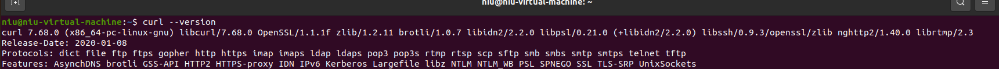
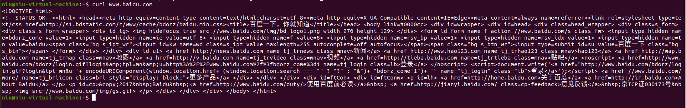
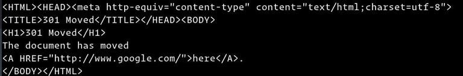

# 安装使用方法

## 一。Linux下安装curl

### 简介

curl 是常用的命令行工具，用来请求 Web 服务器。它的名字就是客户端（client）的 URL 工具的意思。

它的功能非常强大，命令行参数多达几十种。如果熟练的话，完全可以取代 Postman 这一类的图形界面工具。

### 安装步骤：

##### 1.下载curl包

（可以在这个网站上找最新的版本：   curl 安装包地址https://curl.se/download.html）

执行命令：

wget https://curl.se/download/curl-7.57.0.tar.gz

##### 2.解压：

tar-xzvf  curl-7.57.0.tar.gz

##### 3.进入解压后的curl文件夹：

cd curl-7.57.0

##### 4.输入：

./configure --prefix=/usr/local/curl
5.输入：

make && make install

##### 6.检查安装是否成功：

curl --version
出现以下信息，说明安装成功了。 



##### 7.测试是否可以使用：

curl www.baidu.com




# 二、实例教程 

https://linuxize.com/post/curl-command-examples/

`curl`是一个命令行实用程序，用于从服务器传输数据或将数据传输到服务器，该服务器设计为无需用户交互即可工作。借助`curl`，您可以使用支持的协议之一下载或上传数据，包括 HTTP、HTTPS、[SCP](https://linuxize.com/post/how-to-use-scp-command-to-securely-transfer-files/) 、[SFTP](https://linuxize.com/post/how-to-use-linux-sftp-command-to-transfer-files/) 和[FTP](https://linuxize.com/post/how-to-use-linux-ftp-command-to-transfer-files/) 。`curl`提供了许多选项，允许您恢复传输、限制带宽、代理支持、用户身份验证等等。

在本教程中，我们将通过实际示例和最常见的 curl 选项的详细解释向您展示如何使用 curl 工具。

### 安装curl

目前大多数 Linux 发行版都预装了 curl 包。

要检查您的系统上是否安装了 Curl 包，请打开您的控制台，键入`curl`，然后按回车键。如果已经`curl`安装，系统会打印*`curl: try 'curl --help' or 'curl --manual' for more information`*。否则，您会看到类似*`curl command not found`*.

如果`curl`未安装，您可以使用发行版的包管理器轻松安装它。

### 在 Ubuntu 和 Debian 上安装 Curl

```
sudo apt update
sudo apt install curl
```

### 在 CentOS 和 Fedora 上安装 Curl

```
sudo yum install curl
```

## 如何使用卷曲

该`curl`命令的语法如下：

```sh
curl [options] [URL...]
```

在其最简单的形式中，当不带任何选项调用时，`curl`将指定的资源显示到标准输出。

例如，要检索`example.com`您将运行的主页：

```
curl example.com
```

`example.com`该命令将在您的终端窗口中打印主页的源代码。

如果未指定协议，则`curl`尝试猜测您要使用的协议，默认为`HTTP`.

## 将输出保存到文件

要保存`curl`命令的结果，请使用`-o`或`-O`选项。

小写字母`-o`使用预定义的文件名保存文件，在下面的示例中是`vue-v2.6.10.js`：

```
curl -o vue-v2.6.10.js https://cdn.jsdelivr.net/npm/vue/dist/vue.js 
```

Uppercase`-O`使用其原始文件名保存文件：

```
curl -O https://cdn.jsdelivr.net/npm/vue/dist/vue.js 
```

## 下载多个文件

要一次下载多个文件，请使用多个`-O`选项，然后是要下载的文件的 URL。

在以下示例中，我们正在下载 Arch Linux 和 Debian iso 文件：

```
curl -O http://mirrors.edge.kernel.org/archlinux/iso/2018.06.01/archlinux-2018.06.01-x86_64.iso  \ 
	 -O https://cdimage.debian.org/debian-cd/current/amd64/iso-cd/debian-9.4.0-amd64-netinst.iso
```

## 恢复下载

您可以使用该`-C -`选项恢复下载。如果您的连接在下载大文件期间断开，这很有用，您可以继续上一个文件而不是从头开始下载。

例如，如果您使用以下命令下载 Ubuntu 18.04 iso 文件：

```
curl -O http://releases.ubuntu.com/18.04/ubuntu-18.04-live-server-amd64.iso
```

突然你的连接断开你可以恢复下载：

```
curl -C - -O http://releases.ubuntu.com/18.04/ubuntu-18.04-live-server-amd64.iso
```

## 获取 URL 的 HTTP 标头

HTTP 标头是以冒号分隔的键值对，其中包含用户代理、内容类型和编码等信息。标头随请求或响应在客户端和服务器之间传递。

使用该`-I`选项仅获取指定资源的 HTTP 标头：

```
curl -I --http2 https://www.ubuntu.com/
```


## 测试网站是否支持 HTTP/2

要检查特定 URL 是否支持新的[HTTP/2 协议](https://en.wikipedia.org/wiki/HTTP/2)`-I`，请使用以下选项 获取 HTTP 标头`--http2`：

```
curl -I --http2 -s https://linuxize.com/ | grep HTTP
```

该`-s`选项告知`curl`以静默（安静）方式运行并隐藏进度表和错误消息。

如果远程服务器支持 HTTP/2，`curl`打印`HTTP/2.0 200`：

```output
HTTP/2 200
```

否则，响应是`HTTP/1.1 200`：

```output
HTTP/1.1 200 OK
```

如果您有 curl 版本`7.47.0`或更高版本，则不需要使用该`--http2`选项，因为默认情况下为所有 HTTPS 连接启用 HTTP/2。

## 跟随重定向

默认情况下，`curl`不遵循 HTTP Location 标头。

如果您尝试检索 的非 www 版本，您会注意到您将被重定向到 www 版本，而不是获取页面的源代码：`google.com`

```
curl google.com
```



该`-L`选项指示`curl`遵循任何重定向，直到它到达最终目的地：

```
curl -L google.com
```

## 更改用户代理

有时在下载文件时，远程服务器可能会设置为阻止 Curl User-Agent 或根据访问者设备和浏览器返回不同的内容。

在这种情况下要模拟不同的浏览器，请使用该`-A`选项。

例如，要模拟 Firefox 60，您可以使用：

```
curl -A "Mozilla/5.0 (X11; Linux x86_64; rv:60.0) Gecko/20100101 Firefox/60.0" https://getfedora.org/
```

## 指定最大传输速率

该`--limit-rate`选项允许您限制数据传输速率。该值可以用字节表示，千字节用`k`后缀表示，兆字节用`m`后缀表示，千兆字节用`g`后缀表示。

在以下示例`curl`中，将下载 Go 二进制文件并将下载速度限制为 1 mb：

```
curl --limit-rate 1m -O https://dl.google.com/go/go1.10.3.linux-amd64.tar.gz
```

此选项可用于防止`curl`消耗所有可用带宽。

## 通过 FTP 传输文件

要使用 访问受保护的 FTP 服务器`curl`，请使用该`-u`选项并指定用户名和密码，如下所示：

```
curl -u FTP_USERNAME:FTP_PASSWORD ftp://ftp.example.com/
```

登录后，该命令会列出用户主目录中的所有文件和目录。

您可以使用以下语法从 FTP 服务器下载单个文件：

```
curl -u FTP_USERNAME:FTP_PASSWORD ftp://ftp.example.com/file.tar.gz
```

要将文件上传到 FTP 服务器，请使用`-T`后跟要上传的文件的名称：

```
curl -T newfile.tar.gz -u FTP_USERNAME:FTP_PASSWORD ftp://ftp.example.com/
```

## 发送 Cookie

有时您可能需要使用特定 cookie 发出 HTTP 请求以访问远程资源或调试问题。

默认情况下，当使用 请求资源时`curl`，不会发送或存储任何 cookie。

要将 cookie 发送到服务器，请使用`-b`后跟包含 cookie 或字符串的文件名的开关。

例如，要下载 Oracle Java JDK [rpm 文件](https://linuxize.com/post/how-to-install-rpm-packages-on-centos/) `jdk-10.0.2_linux-x64_bin.rpm`，您需要传递一个名为`oraclelicense`value的 cookie `a`：

```
curl -L -b "oraclelicense=a" -O http://download.oracle.com/otn-pub/java/jdk/10.0.2+13/19aef61b38124481863b1413dce1855f/jdk-10.0.2_linux-x64_bin.rpm
```

## 使用代理

`curl`支持不同类型的代理，包括 HTTP、HTTPS 和 SOCKS。要通过代理服务器传输数据，请使用`-x`( `--proxy`) 选项，后跟代理 URL。

以下命令使用`192.168.44.1`端口上的代理下载指定资源`8888`：

```
curl -x 192.168.44.1:8888 http://linux.com/
```

如果代理服务器需要身份验证，请使用`-U`( `--proxy-user`) 选项，后跟用冒号 ( `user:password`) 分隔的用户名和密码：

```
curl -U username:password -x 192.168.44.1:8888 http://linux.com/
```

## 结论

`curl`是一个命令行工具，允许您从远程主机传输数据或向远程主机传输数据。它可用于解决问题、下载文件等。

本教程中显示的示例很简单，但演示了最常用的`curl`选项，旨在帮助您了解`curl`命令的工作原理。

有关`curl`访问[Curl 文档](https://curl.haxx.se/docs/) 页面的更多信息。

