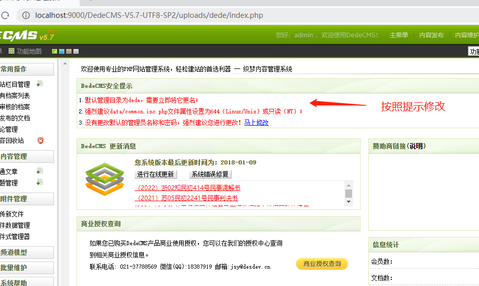
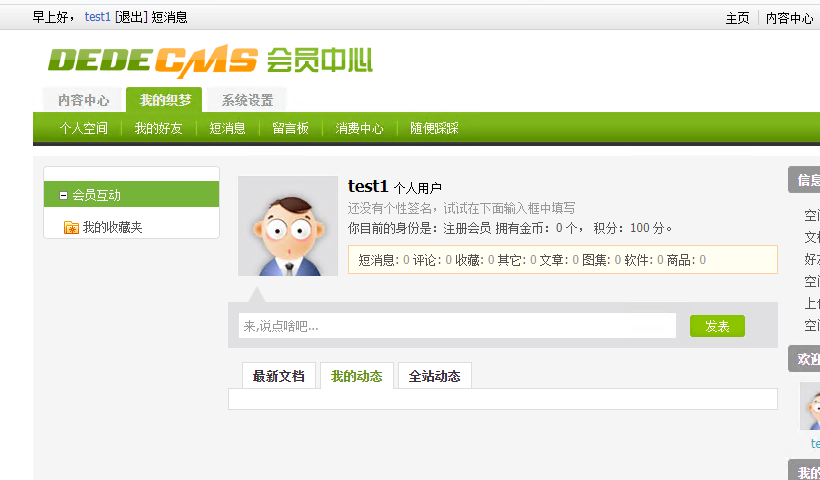
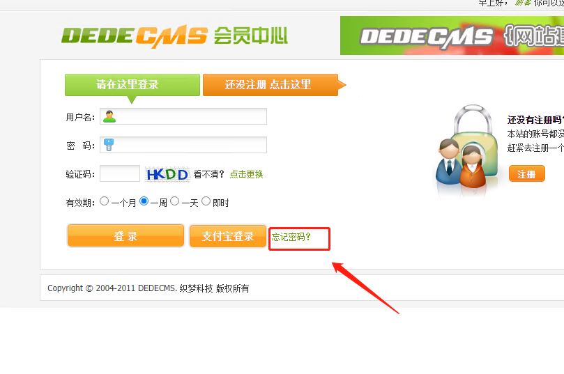

#### 作业：

复现cms

------------------------------------------------

### 一、dedecms搭建

工具：phpstudy

vps：windows2019

下载源码： https://www.xiuzhanwang.com/dedecms_az/1749.html

这里使用phpstudy搭建工具，下载好的源码放到网站目录里

主页文件内添加链接

访问主页，选择upload

输入admin admin登录

cms搭建完成，访问网站即可

## 漏洞分析及复现

### 前台任意用户密码修改

### 漏洞成因

在用户密码重置功能处，php存在弱类型比较，导致如果用户没有设置密保问题的情况下可以绕过验证密保问题，直接修改密码(管理员账户默认不设置密保问题)。值得注意的是修改的密码是member表中的密码，即使修改了管理员密码也是member表中的管理员密码，仍是无法进入管理。

### 漏洞复现

首先打开后台管理页面开启会员功能

注册一个账户

点击通过安全问题取回

点下一步抓包，发送repeater

dopost=safequestion&id=1&userid=admin&safequestion=00&safeanswer=0&vdcode=Vs4p

这是正常应该返回到页面，但是我的每次都报错，不知道为撒