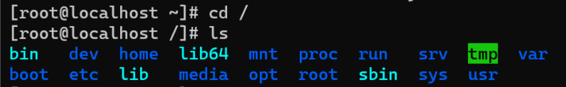

# Linux命令基础

关机命令：poweroff

halt（需要root权限）

`reboot`                        	  立刻重启：

`shutdown  -c`  				 取消前一个关机命令

`shutdown  -h now`  		立刻关机

`shutdown  -h 10`  		   10分钟后关机

`shutdown  -h 11:11`   	11:11关机

`shutdown  -r  now`  	   立刻重启

`shutdown  -r  10`   		 10分钟后重启

`shutdown  -r  11:11`       11:11重启

init 命令：

init 0  	关机

init 3  	纯文本模式

init 5	图形模式

init 6	重新启动

pwd：查看工作目录

ls：查看指定目录的内容

-l：列表显示

-a：显示全部，包括隐藏文件

-h：人性化显示

-d：只显示目录

cd：切好工作目录

.    当前目录

..  上一级目录

~  用户家目录

\-   上次切过来的目录

**目录结构：**

Linux目录与win完全不同，是从” / “开始，只有它没有上一级目录，因此叫根目录

  

详细介绍：

/bin ：大部分的系统命令

/boot：启动相关目录

/dev：设备目录文件，Linux下一切设备皆是文件

/etc：配置文件目录

/home：普通用户的家目录，一个用户对应一个文件夹

/lib：库文件

/lib64：64位的库文件

/lost+found：系统异常时临时保存数据，用于恢复等操作

/media：媒体目录

/mnt：挂载目录，通用挂载点

/opt：安装系统非必须软件目录

/proc：虚拟文件系统，会映射硬件信息

/root：root用户的家目录

/sbin：超级用户才能执行的命令

/selinux：Linux下的一套很复杂安装机制，通常关闭不用。

/srv：存放本机或者本机服务器的数据或服务

/sys：类似于/proc，也是虚拟文件系统，可以映射系统信息。

/tmp：临时文件

/usr：存放用户安装的应用程序。

/var：系统产生的不可自动销毁的文件，如：日志、缓存等

mkdir ：创建文件夹

touch：创建文件

ip a  /ip addr centos7之后，使用ip命令查看网卡信息

ifdown /ifup 禁用网卡/启动网卡 

Linux不会自动检测网络ip

ping 网络测试  对目标主机发送数据包

ls

cat   （记事本工具）以文本的模式查看文件

vi     编辑普通文本

/bin   bin是binary的缩写，存放经常使用的命令

ls  ./ =ls 

mk dir -p /etc/a/b/c/

rmdir -p /etc/a/b/c/     删除空文件夹

touch a  创建文件a

echo >> b

echio >a

vi a

mv /etc/ etcs 重命名

\------------

文件文件夹操作：

增

touch

vi：wq

echo>a.txt

mkdir -p

删

rmdir  // 只能删除空文件夹

rm -rf // 误删除

查

pwd

ls

cat

tac

head  -n

tail  -n   -f

grep

find

more

whereis

which

改

cd

cp  -r

cat /etc/passwd > ./passwd

vi :wq

mv

touch -t201605171210.20 test.txt 修改文件创建时间、最后修改时间

特殊字符：

\-    上一个路径

~   用户主目录

.     当前路径

..     上一级目录

|      管道符，把前面的输出，作为后面的输入，

​	ls  |  xargs rm -rf 

\>     输出重定向，直接覆盖原有内容

​	echo 123>a.txt

\>>   输出重定向，追加内容

''	优先运行命令

​	rm -rf 'ls'

​	ping 'whoami'.ceye.co

$()  变量

​	rm -rf $(ls)

\-------------------

 ping  dns 服务器

 ping `whoami`312g4g.dnslog.cn

\----------------------

jobs

ctrl z 

fg %1

\--------------

tar zcvf /root/network.tgz ./   压缩打包

tar 打包

tar cvf a.tar ./*

tar xvf a.tar 

tar zcvf b.tar.gz ./*

tar zxvf b.tar.gz 

zxvf  解压 

linux 不需要后缀名

\---------------------------

vi

i 输入

esc退出

：wq保存退出

：q! 强制退出
