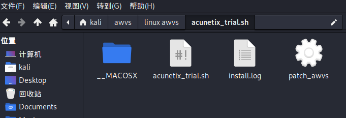
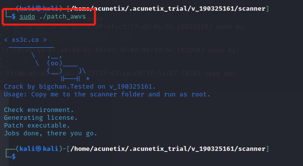

# awvs安装使用

#### 在kali中安装awvs

安装包复制到kali中新建的awvs文件夹下，解压，在文件夹下 执行

`ls -al`

`chmod -x acunetix_trial.sh`   

加个执行权限，然后ls查看 发现变成绿色即可

`sudo ./acunetix_trial.sh`

运行文件，下面显示很多 

按`q`退出

输入`yes`

下面输入账号密码 自己记住就好 邮箱可以自己随便填写 登录用的

kali13@qq.com	 Kali13@qq.com  因为密码要求有8位，大小写，特殊符号

成功后，可以访问https+ip+13443端口

输入账号密码登录，但是这里是试用版

将另一个文件也给执行权限 然后复制

`sudo cp patch_awvs /home/acunetix/.acunetix_trial/v_190325161/scanner/`   

然后进入文件夹，执行文件，看到显示一头牛，这样就破解好了，回去刷新网页，就看到日期变成2999年了

#### 软件的使用

这里输入目标ip 

设置好以后save保存 然后scan 开始扫描

因为是主动扫描可以设置时间在 闲时或者定时，或者开代理，或者将awvs部署在vps上

#### windows下安装AWVS

可以参考以下教程，比较简单，可以自行安装

https://www.cnblogs.com/chun-xiaolin001/p/10060830.html

#### AWVS忘记了密码怎么办，需要重新安装吗？

不需要，可以进入kali的

/home/acunetix/.acunetix_trial目录下，

运行change_credentials.sh，可以直接重置密码

