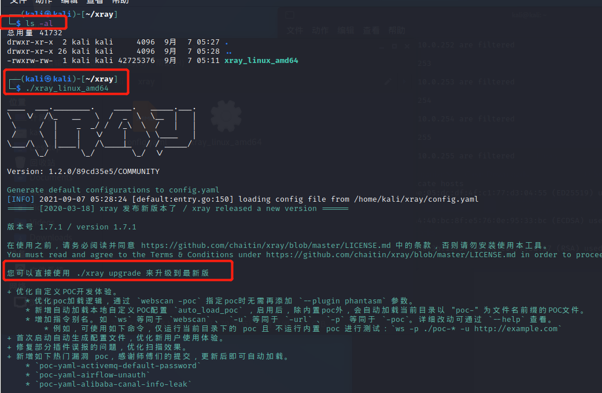
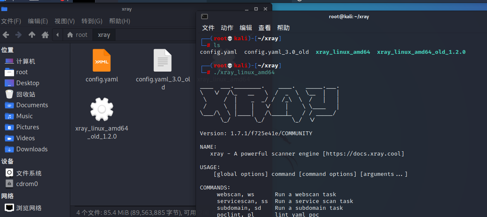
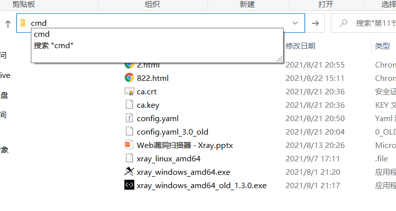
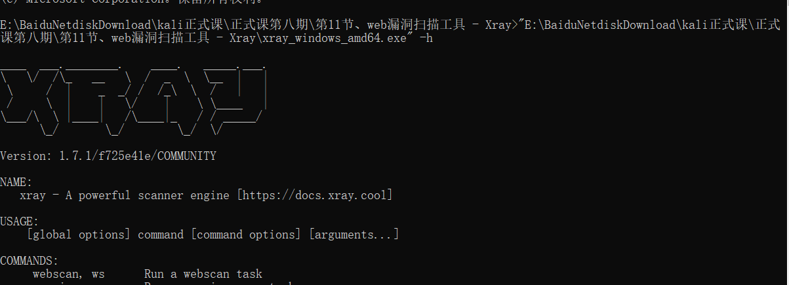

# **xray用法**

## 在kali中安装运行

将安装包复制到kali中，直接在当前文件夹下运行终端



`./xray_linux_amd64 upgrade`

升级程序



##### xray文件夹运行命令行

##### 查看帮助

​		命令：

​		`xray_windows_amd64.exe -h`

#### Xray可借助爬虫进行漏洞检查

​		命令：

​		`xray_linux_amd64   webscan --basic-crawler  http://172.16.12.2`


windows系统下在xray文件夹下运行cmd，可以将结果输出为html


> ```linux
> xray_windows_amd64.exe webscan --basic-crawler http://192.168.179.75/login/ --html-output 824.html
> ```


#### 被动扒寻模式

运行Xray，开启监听,浏览器安装ca证书，设置proxy 开启端口7777

命令：

`xray_windows_amd64.exe webscan --listen 127.0.0.1:7777 --html-output test.html`

现在cmd中开启监听，然后在浏览器 开启代理，刷新网页，进行被动扫描


### 在Windows中安装运行

下载到本地后，再文件夹目录上输入cmd



直接用鼠标拖动EXE文件到cmd中就行了

用法就是 后面直接跟命令



**查看帮助**

命令：

`xray_windows_amd64.exe -h`

##### Xray可借助爬虫进行漏洞检查导出到1.html

命令：

`xray_windows_amd64.exe webscan --basic-crawler http://www.baidu.com --html-output 1.html` 

`xray_windows_amd64.exe webscan --url http://www.baidu.com` 参数不能同时使用

#### 安装浏览器插件

##### 1、安装浏览器代理插件

foxyproxy，SwitchyOmega等都行

##### 2、启动Xray，生成ca证书

命令：

`xray_windows_amd64.exe genca`

##### 3、安装证书并信任（只装一次就可）

浏览器安装证书的方法有所查别，具体可参考Xray的使用文档（Firefox 浏览器只能在浏览器内导入证书）

##### 4.运行Xray，开启监听

命令：

`xray_windows_amd64.exe webscan --listen 127.0.0.1:7777 --html-output test.html`

##### 5、浏览器启用代理，端口与 Xray 一致

刷新页面

### 新版特性

- 优化自定义POC开发体验。

  - 优化poc加载逻辑，通过 `webscan -poc` 指定poc时无需再添加 `--plugin phantasm` 参数。
  - 新增自动加载本地自定义POC配置 `auto_load_poc` ，启用后，除内置poc外，会自动加载当前目录以 "poc-" 为文件名前缀的POC文件。
  - 增加指令别名。如`ws` 等同于 `webscan`，`-u` 等同于 `-url`，`-p` 等同于 `-poc` 。详细改动可通过`--help`查看。
    - 例如，可使用如下命令，仅运行当前目录下的 poc 且 不运行内置 poc 进行测试：`ws -p ./poc-* -u http://example.com`
  
- 首次启动自动生成配置文件，优化新用户使用体验。

- 修复部分插件误报的问题，优化扫描效果。

- 新增如下poc，感谢师傅们的提交，更新后即可自动加载。

  - `poc-yaml-activemq-default-password`
  - `poc-yaml-airflow-unauth`
  - `poc-yaml-alibaba-canal-info-leak`
  - `poc-yaml-apache-kylin-unauth-cve-2020-13937`
  - `poc-yaml-ecshop-cnvd-2020-58823-sqli`
  - `poc-yaml-ecshop-rce`
  - `poc-yaml-exchange-cve-2021-26855-ssrf`
  - `poc-yaml-odoo-file-read`
  - `poc-yaml-rockmongo-default-password`
  - `poc-yaml-sonicwall-ssl-vpn-rce`
  - `poc-yaml-vmware-vcenter-unauthorized-rce-cve-2021-21972`
  - `poc-yaml-yonyou-grp-u8-sqli`

https://github.com/chaitin/xray/releases
