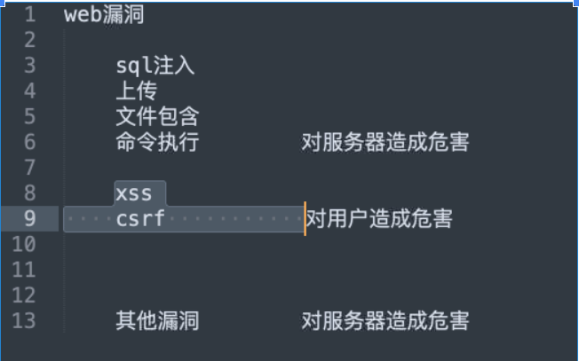
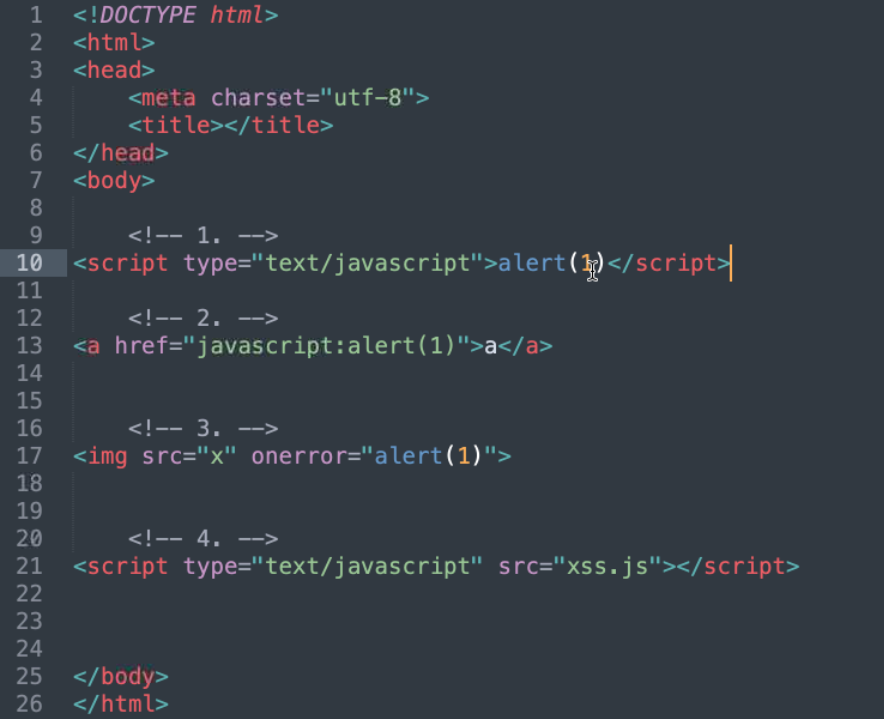
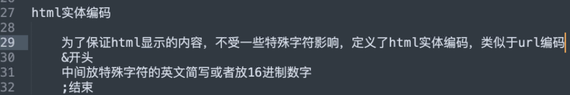
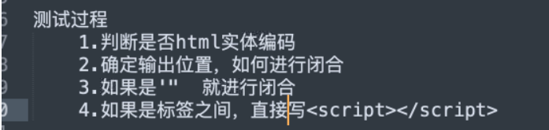
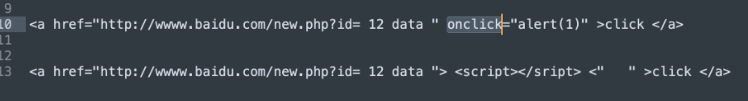
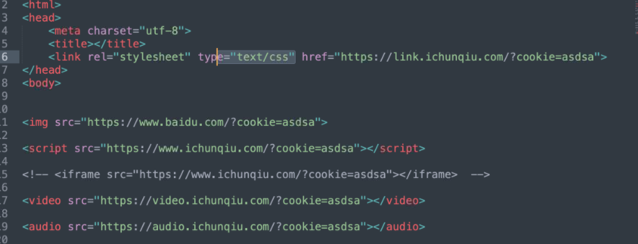
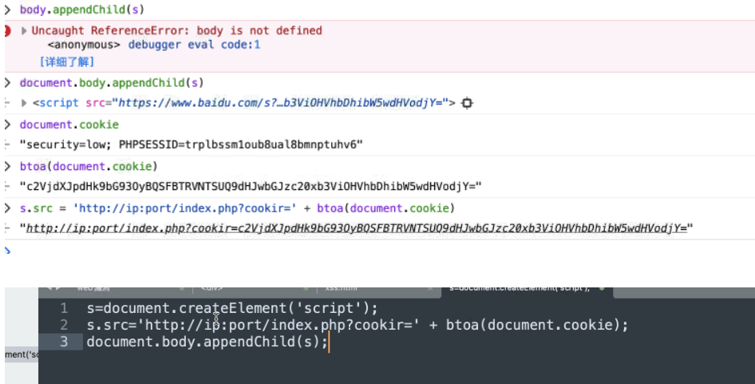
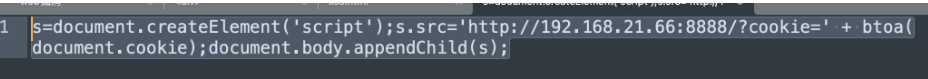
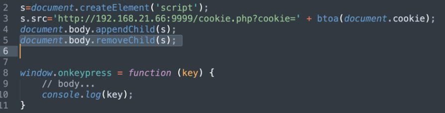

**XSS：**

​		前端代码，HTML,CSS,JAVASCRIPT

**XSS注入核心：**

​		用户输入的数据被当做前端代码执行

##### 查看前端代码：

​		chorme浏览器 view-source: 前端网址

**xss作用：**

​		窃取cookie（用的最频繁）

​		获取内网ip

​		获取浏览器保存的明文密码

​		截取网页屏幕

​		网页上的键盘记录

**xss类型：**

​		反射型    

​				1.``

​				2.伪协议：`<a herf=Javascript: alert(1)/>1</a>`

​				3.事件型

​		存储型（你提交的数据成功的实现了xss，存入了数据库，别人访问这个页面的时候就会自动触发	）

​		存储型xss会出现在什么地方？

​		任何可能插入数据库的地方

​				留言板

​				上传文件的文件名

​			（管理员可见的）报错信息

**浏览器：**

​		同源策略，限制了cookie作用域（a网站只能访问a的cookie，b网站只能访问b的cookie）

​		浏览器根据访问网站的不同自动填充cookie

##### 同源：

​		同域名，同端口，同协议（http://a.com/a和http://a.com/b）

前端代码与后端不同，有容错性（体验感包容性）

 `<input name="keyword" value="" oninput=alert(1//")>` 用// 注释掉结尾的 “>，系统会自动补全

#### 注入神器

​		`<iframe onload="alert(1)">//`

#### 防止窃取

​		`cookie : http-only`

**JS 4种触发方法**

1.SCRIPT标签

2.伪协议

3.事件

4.调用js文件

优先级 1,4,3,2

一般使用1和4  第二种需要触发

**如何防xss：**

html实体编码：比如（ `&nbsp;`）空格（`&lt;` ）左尖括号（`&gt;`）右尖括号  

**找xss：**

查看源代码 闭合方式

a标签有		 onclick  onmouseover  

img标签 		 onerror	onclick	onmouseover

input标签		onchange	onmouseover

svg标签		onload	onclick	onmouseover

事件 onload  onerror 会在页面加载完成后触发

剩下的都需要手动触发

可以自动http服务的标签

**将cookie进行base64编码，使用btoa** 

**抓到网站所有cookie 和键盘记录**

